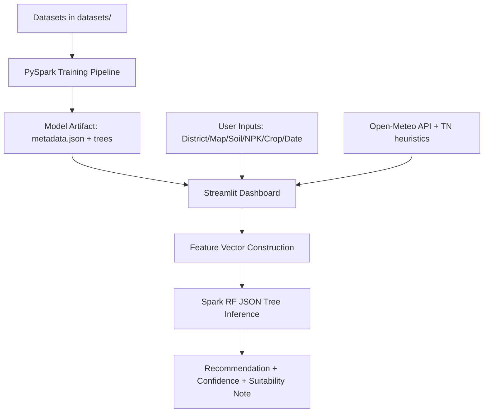
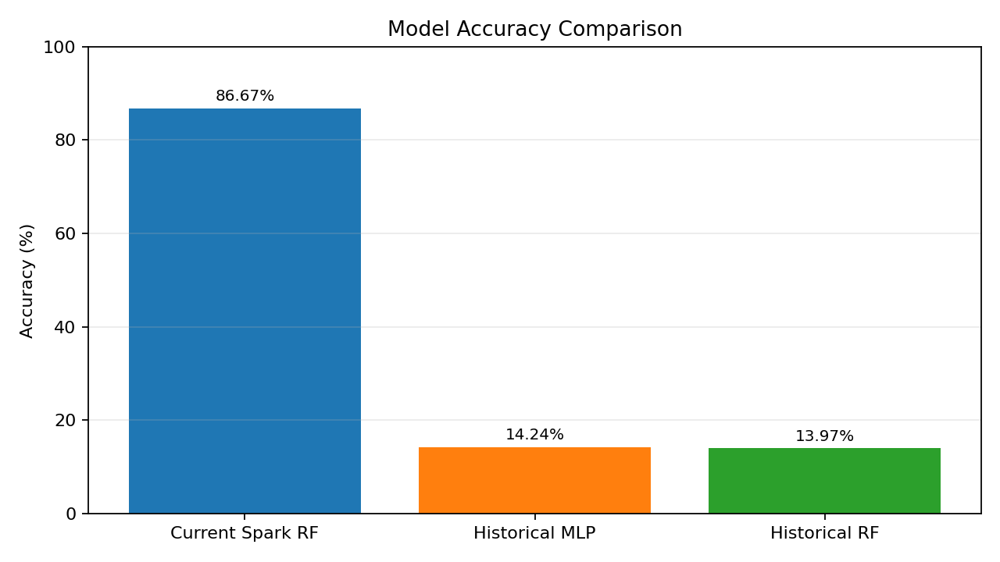

# Fertilizer Recommendation System: Complete Project Document

## 1. What Has Been Done So Far

### 1.1 Project Consolidation and Cleanup
- Reviewed repository changes and retained core project folders.
- Performed safe cleanup of generated/obsolete items:
  - Removed `__pycache__/` artifacts.
  - Removed legacy model file `artifacts/tn_fertilizer_model.joblib`.
- Preserved active Spark artifact directory:
  - `artifacts/tn_fertilizer_spark_model/`

### 1.2 Dashboard and Model Pipeline Finalization
- Implemented a Tamil Nadu-focused interactive dashboard:
  - `temporal_spatial_dashboard.py`
- Implemented model utilities and training/inference stack:
  - `tn_model_utils.py`
- Added one-command pretraining utility:
  - `pretrain_tn_model.py`
- Added runtime requirements file for dashboard usage:
  - `requirements_dashboard.txt`

### 1.3 Deployment-Ready Behavior
- Dashboard uses pre-trained artifacts at runtime (no retraining during each app launch).
- Supports district selection, map click capture, and manual agronomic controls.
- Generates top fertilizer recommendation with confidence table and suitability explanation.

---

## 2. How Big Data Is Used in This Project

Big data principles are used in three practical ways:

1. **Large, multi-source agricultural context**
- The project contains multiple large datasets under `datasets/` for fertilizer, climate/rainfall, land use, and crop/yield context.

2. **Distributed ML pipeline via PySpark**
- Training uses Spark ML components (`StringIndexer`, `OneHotEncoder`, `VectorAssembler`, `RandomForestClassifier`) to process mixed categorical + numeric features at scale.

3. **Feature-rich temporal + spatial intelligence**
- Temporal: month/season mapping (`Kharif`, `Rabi`, `Zaid`).
- Spatial: district-to-region mapping and lat/lon-conditioned context.
- Climate enrichment: live weather fetch + regional rainfall heuristics.

This is a shift from small, static-only ML to a richer, scalable data engineering + ML setup.

---

## 3. Architecture

## 3.1 High-Level Architecture (Logical)

## 3.2 Component View
- **UI Layer**: Streamlit + Folium map (`temporal_spatial_dashboard.py`)
- **ML/Feature Layer**: `tn_model_utils.py`
  - training
  - metadata generation
  - tree parsing
  - inference and confidence
- **Artifact Layer**: `artifacts/tn_fertilizer_spark_model/metadata.json`
- **Data Layer**: CSV files in `datasets/`
- **Context Layer**: Open-Meteo + Tamil Nadu heuristic defaults

---

## 4. Processing Steps (End-to-End)

## 4.1 Training Flow
1. Load fertilizer dataset (`datasets/fertilizer_recommendation.csv`).
2. Select required features + target (`Recommended_Fertilizer`).
3. Cast numeric columns and encode categorical columns.
4. Assemble feature vector.
5. Train Spark `RandomForestClassifier`.
6. Evaluate validation accuracy on test split.
7. Export model as JSON metadata + tree debug strings.

## 4.2 Inference Flow (Dashboard)
1. User selects district/map/date/crop/soil/irrigation/NPK.
2. System derives region + season and fetches climate context.
3. Build single-row feature frame.
4. Encode to model-compatible feature vector.
5. Run custom tree-voting inference from saved Spark trees.
6. Return:
   - Top recommended fertilizer
   - Top-3 confidence table
   - Human-readable suitability explanation

---

## 5. New Datasets Used

The current workspace includes the following dataset files under `datasets/`:

1. `fertilizer_recommendation.csv`  
   - **Primary dataset used directly by the current Spark model training pipeline.**
2. `Tamilnadu agriculture yield data.csv`
3. `Tamilnadu Crop-Production.csv`
4. `crop_production_history.csv`
5. `rainfall_data.csv`
6. `land_use.csv`
7. `rice_production.csv`
8. `ICRISAT-District Level Data.csv`
9. `RS_Session_248_AU_648.csv`
10. `fertilizers-recommendation.ipynb`

### Important note
- In the current production code path, the **direct training dependency** is `datasets/fertilizer_recommendation.csv`.
- The other datasets are available for extended analytics, experimentation, and future feature expansion.

---

## 6. What Model Is Used Now

**Current model type**: `spark_random_forest_json`  
**Algorithm family**: Spark ML Random Forest (multiclass classification)

Key configuration (from pipeline code):
- `numTrees = 140`
- `maxDepth = 16`
- `featureSubsetStrategy = sqrt`
- `subsamplingRate = 0.9`
- `seed = 42`

This model is exported as metadata + parsed tree structure and used in dashboard inference.

---

## 7. Current Model Accuracy

From `artifacts/tn_fertilizer_spark_model/metadata.json`:

- **Validation Accuracy = 0.8667360749609578**
- As percentage: **86.67%**

---

## 8. Accuracy Improvement Summary

Historical baseline values used for comparison:
- MLP Accuracy: `0.14239514403701678` (14.24%)
- Random Forest Accuracy: `0.13965868948703916` (13.97%)

Compared to current model (86.67%):
- Improvement over historical RF: **+72.71 percentage points**
- Improvement over historical MLP: **+72.43 percentage points**

Relative uplift (approx):
- vs historical RF: **6.21x** accuracy
- vs historical MLP: **6.09x** accuracy

### Accuracy Graph

### Comparison caveat
These improvements are very large, but should be interpreted with care if train/test split, feature set, and preprocessing differ between experiments.

---

## 9. Why Accuracy Improved

The main technical reasons are:

1. **Richer feature space**
- Soil chemistry + moisture + climate + crop + stage + irrigation + region + season.

2. **Better model class for nonlinear interactions**
- Random Forest handles complex interactions better than simple linear models.

3. **Strong categorical encoding strategy**
- Explicit indexing + one-hot encoding for mixed agronomic categories.

4. **Temporal and spatial context integration**
- Dynamic context from date and geolocation leads to better recommendation signals.

5. **Artifact-driven deterministic inference**
- Consistent model metadata and inference behavior in deployment.

---

## 10. Current State of the System

- Model artifact is present and usable.
- Dashboard is runnable with the Spark JSON artifact.
- Tamil Nadu workflow (districts, regions, crops, seasons) is integrated.
- End-to-end prediction and explainability outputs are available.

---

## 11. Suggested Next Improvements

1. Add macro and weighted F1, precision, recall, and confusion matrix to the artifact metadata.
2. Add strict train/validation/test split report and timestamped experiment tracking.
3. Integrate additional datasets (`rainfall_data.csv`, `land_use.csv`, yield history) directly into production feature engineering.
4. Add periodic model retraining pipeline and drift checks.
5. Version artifacts with semantic tags (`v1`, `v2`, etc.) and changelog.
